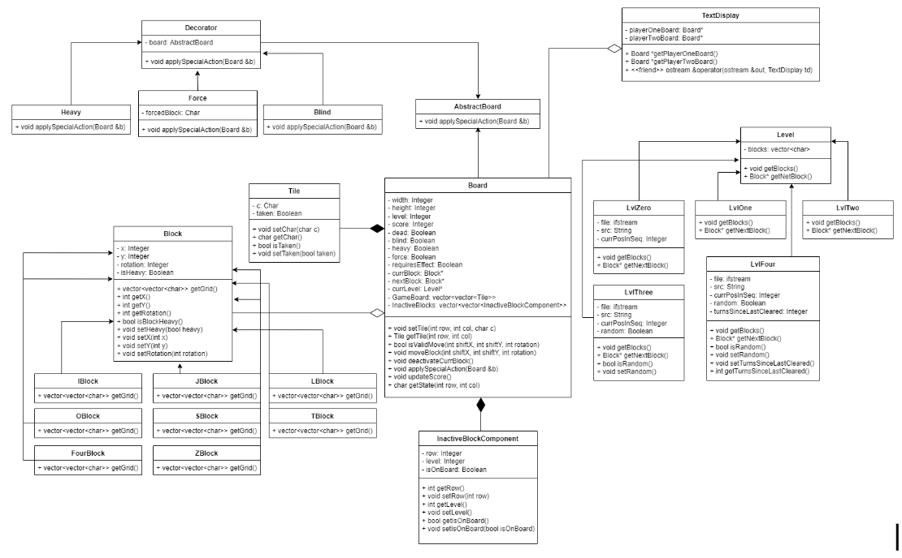

# Biquadris
A multiplayer, terminal-based implementation of Tetris

## Features
- Block rotations (clockwise, counterclockwise), drops, shifts in any direction 
- Score tracking using a variant of Tetris rules 
- Special actions (blind, heavy, force)
- Five different levels, where each level has increased difficulty and a higher score reward.
- Can play with another person (multiplayer)

## Design
The design for the project is outlined in the UML below. The design is based on OOP rules/patterns. 
The most important components are the use of the Decorator pattern for implementing special effects, 
and the factory method pattern for levels. Different polymorphic approaches were used for other components,
with a goal of achieving minimal re-compilation on modification (and of course high cohesion, low coupling).

 
